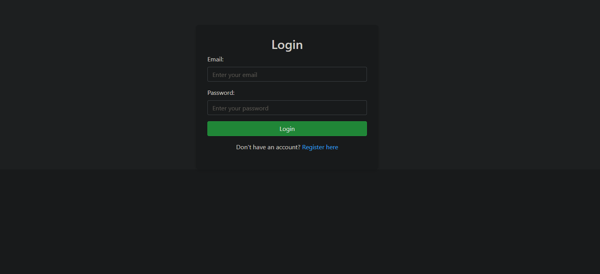
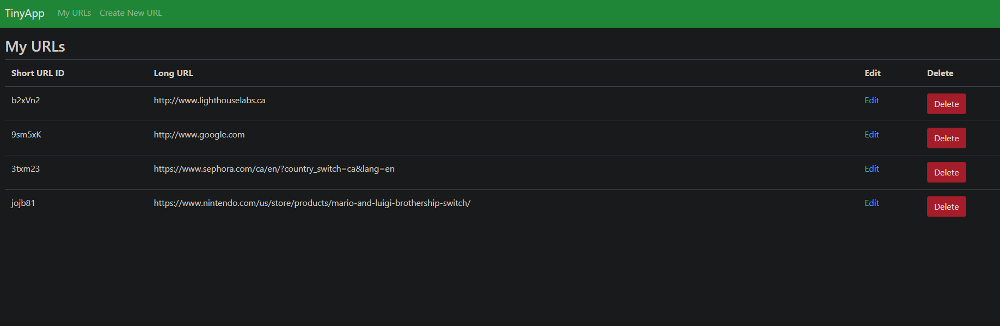

# TinyApp Project

TinyApp is a full stack web application built with Node and Express that allows users to shorten long URLs (à la bit.ly).

## Final Product

## Dependencies

- Node.js
- Express
- EJS
- bcryptjs
- cookie-session

## Getting Started

- Install all dependencies (using the `npm install` command).
- Run the development web server using the `npm start` command.
- Once the server is running, open your browser and navigate to: http://localhost:8080

## Features

- Register/Login: Create an account with an email and password. Passwords are securely hashed using bcryptjs.
- Shorten URLs: Enter long URLs and get shortened versions for easy sharing.
- Personalized Dashboard: View, edit, and delete your URLs. 
- Session Management: Stay logged in with session-based cookies handled by cookie-session.
